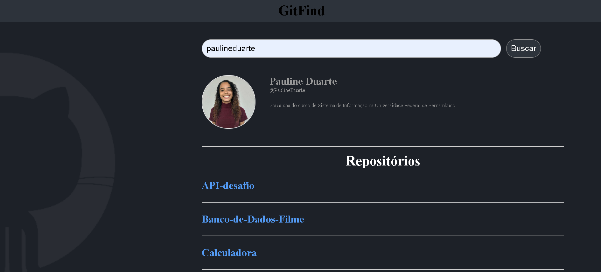

# Projeto GitFind 
Foi desenvolvido um projeto para buscar o perfil e os repositórios que os usuários possuem no github. Nesse projeto foi utilizado a api do github para buscar os perfies e seus devidos repositorios no github. 

 
 
## Ferramentas utilizadas 
- Javascript 
- Css 

